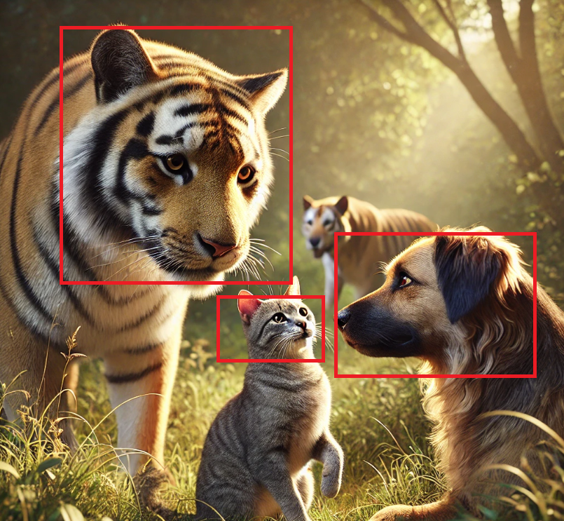
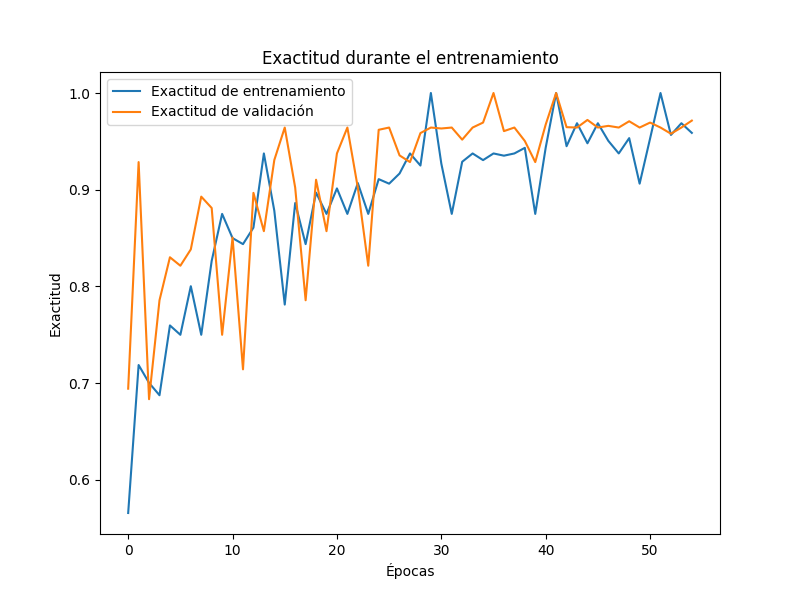
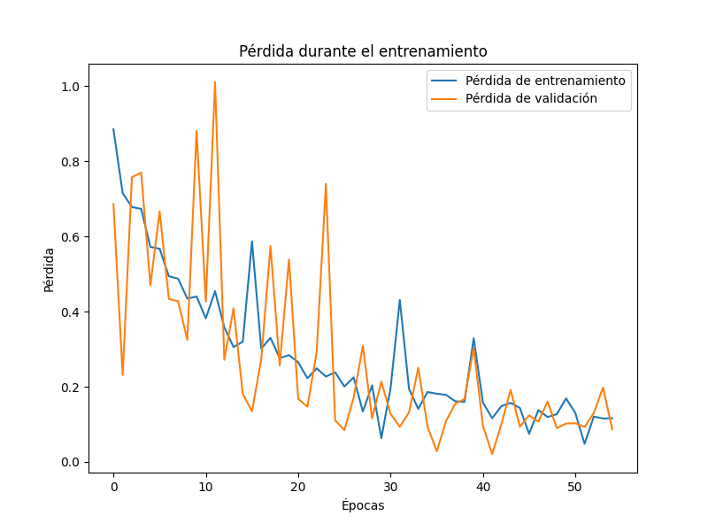
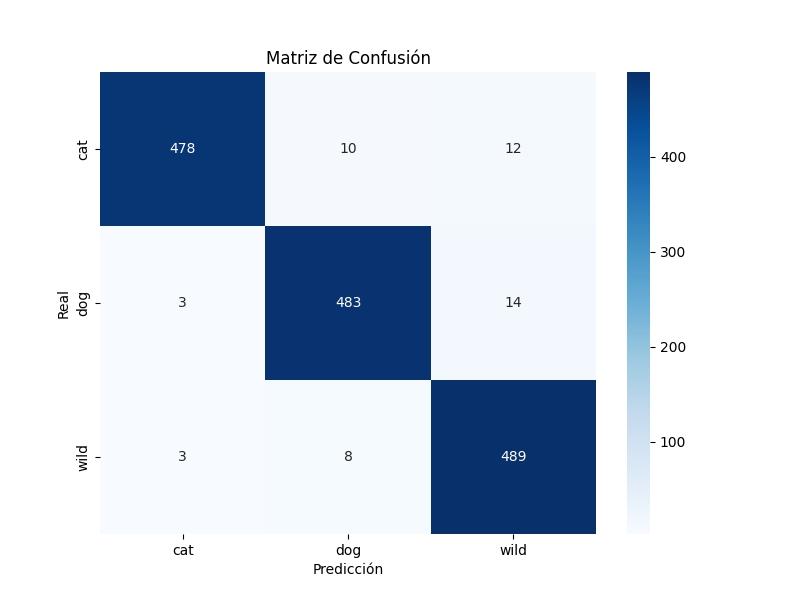
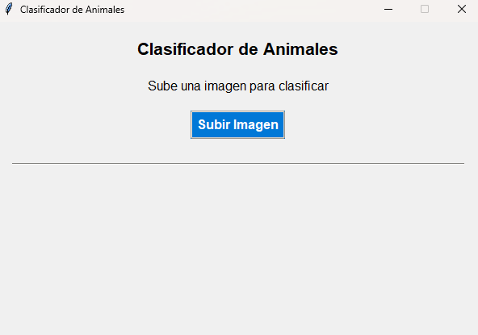
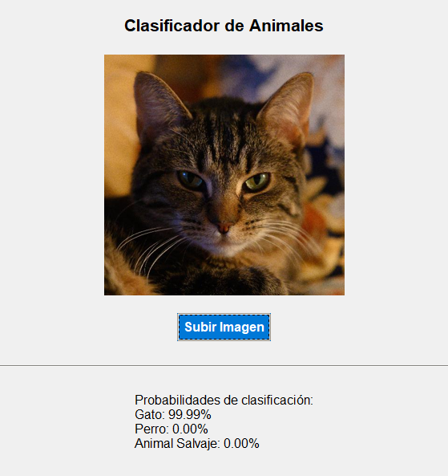
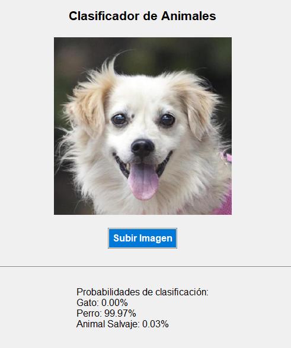
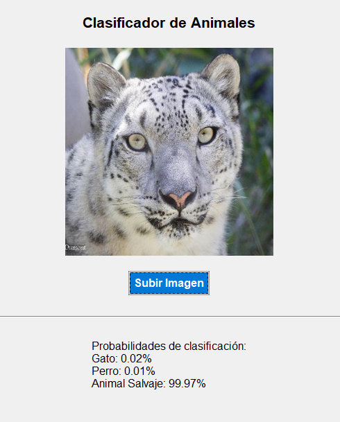
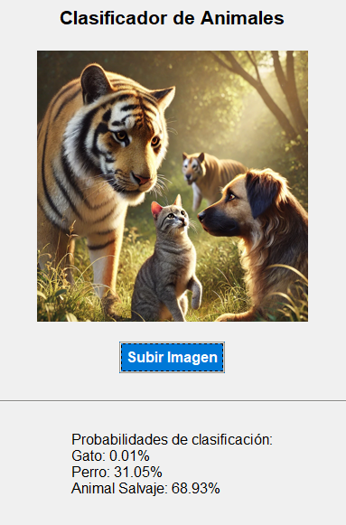

# Clasificación de Imágenes de Animales con Redes Neuronales Convolucionales (CNN)



## Introducción al Proyecto

Este proyecto tiene como objetivo desarrollar una **red neuronal convolucional (CNN)** para clasificar imágenes de animales en tres categorías: **gatos**, **perros** y **animales salvajes**. Utilizando técnicas de **aprendizaje profundo**, el modelo es capaz de reconocer y clasificar imágenes con alta precisión.

Se implemnta en **Python** utilizando **TensorFlow** y **Keras** como frameworks principales para la construcción y entrenamiento de la red neuronal. Se emplea el dataset **"Animal Faces"**, disponible en Kaggle, que proporciona una amplia colección de imágenes para cada categoría, permitiendo un entrenamiento robusto del modelo.

## Requisitos

Para ejecutar este proyecto, asegúrate de tener instaladas las siguientes herramientas y bibliotecas:

- **Python 3.8** o superior

- **Bibliotecas de Python**:
  - `tensorflow` (versión 2.6.0)
  - `numpy` (versión 1.19.5)
  - `matplotlib` (versión 3.4.3)
  - `scipy` (versión 1.7.1)
  - `pillow` (versión 8.3.2)
  - `seaborn` (versión 0.11.2)
  - `scikit-learn` (versión 0.24.2)

- **Herramientas de Software utilizadas**:
  - **Visual Studio Code** o cualquier otro editor de código.
  - **CUDA Toolkit** y **cuDNN** (opcional, al tener una tarjeta gráfica de NVIDIA, instalé estas dependencias, pero al final terminé haciéndolo con la CPU ya que daba problemas).

## Instalación

Sigue los siguientes pasos para configurar y ejecutar el proyecto en tu entorno local:

1. **Clona el repositorio**:

   ```bash
   git clone https://github.com/moises60/CNN_classificacion_animales.git
   ```

2. **Accede al directorio del proyecto**:

   ```bash
   cd CNN_classificacion_animales
   ```


3. **Descarga el dataset "Animal Faces"**:

   - Accede al [dataset en Kaggle](https://www.kaggle.com/datasets/andrewmvd/animal-faces/data).
   - Acepta los términos de la licencia **CC BY-NC 4.0**.
   - Descarga y extrae el dataset en el directorio `dataset` del proyecto, siguiendo la estructura:

     ```
     dataset/
     ├── train/
     │   ├── Cat/
     │   ├── Dog/
     │   └── Wild/
     └── val/
         ├── Cat/
         ├── Dog/
         └── Wild/
     ```

4. **Ejecuta el script de entrenamiento**:

   ```bash
   python cnn.py
   ```

   - El modelo comenzará a entrenarse y los pesos serán guardados como `mejor_modelo.keras`.

5. **Ejecuta la interfaz gráfica para clasificar imágenes**:

   ```bash
   python clasificador.py
   ```

   - Se abrirá una ventana donde podrás cargar imágenes y ver las predicciones del modelo.
     
    Epoch 1/60
    457/457 ━━━━━━━━━━━━━━━━━━━━ 68s 147ms/step - accuracy: 0.4787 - loss: 0.9893 - val_accuracy: 0.6943 - val_loss: 0.6861
     
    Epoch 2/60
    457/457 ━━━━━━━━━━━━━━━━━━━━ 0s 301us/step - accuracy: 0.7188 - loss: 0.7152 - val_accuracy: 0.9286 - val_loss: 0.2313
   
    Epoch 3/60
    457/457 ━━━━━━━━━━━━━━━━━━━━ 60s 132ms/step - accuracy: 0.6842 - loss: 0.7114 - val_accuracy: 0.6834 - val_loss: 0.7576
   
    Epoch 4/60
    457/457 ━━━━━━━━━━━━━━━━━━━━ 0s 68us/step - accuracy: 0.6875 - loss: 0.6734 - val_accuracy: 0.7857 - val_loss: 0.7696
   
    Epoch 5/60
    457/457 ━━━━━━━━━━━━━━━━━━━━ 60s 131ms/step - accuracy: 0.7482 - loss: 0.5900 - val_accuracy: 0.8302 - val_loss: 0.4703
   
    Epoch 6/60
    457/457 ━━━━━━━━━━━━━━━━━━━━ 0s 30us/step - accuracy: 0.7500 - loss: 0.5673 - val_accuracy: 0.8214 - val_loss: 0.6669
   
    Epoch 7/60
    457/457 ━━━━━━━━━━━━━━━━━━━━ 60s 132ms/step - accuracy: 0.7936 - loss: 0.5066 - val_accuracy: 0.8383 - val_loss: 0.4336
   
    Epoch 8/60
    457/457 ━━━━━━━━━━━━━━━━━━━━ 0s 62us/step - accuracy: 0.7500 - loss: 0.4876 - val_accuracy: 0.8929 - val_loss: 0.4275
   
    Epoch 9/60
    457/457 ━━━━━━━━━━━━━━━━━━━━ 60s 132ms/step - accuracy: 0.8192 - loss: 0.4484 - val_accuracy: 0.8811 - val_loss: 0.3250
   
    Epoch 10/60
    457/457 ━━━━━━━━━━━━━━━━━━━━ 0s 35us/step - accuracy: 0.8750 - loss: 0.4401 - val_accuracy: 0.7500 - val_loss: 0.8805
   
    Epoch 11/60
    457/457 ━━━━━━━━━━━━━━━━━━━━ 60s 132ms/step - accuracy: 0.8441 - loss: 0.3977 - val_accuracy: 0.8505 - val_loss: 0.4265
   
    Epoch 12/60
    457/457 ━━━━━━━━━━━━━━━━━━━━ 0s 72us/step - accuracy: 0.8438 - loss: 0.4543 - val_accuracy: 0.7143 - val_loss: 1.0100
   
    Epoch 13/60
    457/457 ━━━━━━━━━━━━━━━━━━━━ 60s 132ms/step - accuracy: 0.8628 - loss: 0.3580 - val_accuracy: 0.8967 - val_loss: 0.2715
   
    Epoch 14/60
    457/457 ━━━━━━━━━━━━━━━━━━━━ 0s 70us/step - accuracy: 0.9375 - loss: 0.3058 - val_accuracy: 0.8571 - val_loss: 0.4085
   
    Epoch 15/60
    457/457 ━━━━━━━━━━━━━━━━━━━━ 60s 132ms/step - accuracy: 0.8743 - loss: 0.3322 - val_accuracy: 0.9307 - val_loss: 0.1812
   
    Epoch 16/60
    457/457 ━━━━━━━━━━━━━━━━━━━━ 0s 266us/step - accuracy: 0.7812 - loss: 0.5867 - val_accuracy: 0.9643 - val_loss: 0.1348
   
    Epoch 17/60
    457/457 ━━━━━━━━━━━━━━━━━━━━ 61s 133ms/step - accuracy: 0.8828 - loss: 0.3073 - val_accuracy: 0.9022 - val_loss: 0.2730
   
    Epoch 18/60
    457/457 ━━━━━━━━━━━━━━━━━━━━ 0s 71us/step - accuracy: 0.8438 - loss: 0.3301 - val_accuracy: 0.7857 - val_loss: 0.5740
   
    Epoch 19/60
    457/457 ━━━━━━━━━━━━━━━━━━━━ 60s 131ms/step - accuracy: 0.8996 - loss: 0.2777 - val_accuracy: 0.9103 - val_loss: 0.2565
   
    Epoch 20/60
    457/457 ━━━━━━━━━━━━━━━━━━━━ 0s 38us/step - accuracy: 0.8750 - loss: 0.2843 - val_accuracy: 0.8571 - val_loss: 0.5383
   
    Epoch 21/60
    457/457 ━━━━━━━━━━━━━━━━━━━━ 61s 132ms/step - accuracy: 0.9008 - loss: 0.2699 - val_accuracy: 0.9375 - val_loss: 0.1678
   
    Epoch 22/60
    457/457 ━━━━━━━━━━━━━━━━━━━━ 0s 71us/step - accuracy: 0.8750 - loss: 0.2226 - val_accuracy: 0.9643 - val_loss: 0.1469
   
    Epoch 23/60
    457/457 ━━━━━━━━━━━━━━━━━━━━ 60s 132ms/step - accuracy: 0.9076 - loss: 0.2515 - val_accuracy: 0.9022 - val_loss: 0.2922
   
    Epoch 24/60
    457/457 ━━━━━━━━━━━━━━━━━━━━ 0s 38us/step - accuracy: 0.8750 - loss: 0.2272 - val_accuracy: 0.8214 - val_loss: 0.7398
   
    Epoch 25/60
    457/457 ━━━━━━━━━━━━━━━━━━━━ 60s 132ms/step - accuracy: 0.9100 - loss: 0.2345 - val_accuracy: 0.9620 - val_loss: 0.1107
   
    Epoch 26/60
    457/457 ━━━━━━━━━━━━━━━━━━━━ 0s 252us/step - accuracy: 0.9062 - loss: 0.2006 - val_accuracy: 0.9643 - val_loss: 0.0846
   
    Epoch 27/60
    457/457 ━━━━━━━━━━━━━━━━━━━━ 61s 132ms/step - accuracy: 0.9157 - loss: 0.2263 - val_accuracy: 0.9355 - val_loss: 0.1707
   
    Epoch 28/60
    457/457 ━━━━━━━━━━━━━━━━━━━━ 0s 35us/step - accuracy: 0.9375 - loss: 0.1342 - val_accuracy: 0.9286 - val_loss: 0.3087
   
    Epoch 29/60
    457/457 ━━━━━━━━━━━━━━━━━━━━ 60s 132ms/step - accuracy: 0.9264 - loss: 0.2033 - val_accuracy: 0.9586 - val_loss: 0.1159
   
    Epoch 30/60
    457/457 ━━━━━━━━━━━━━━━━━━━━ 0s 56us/step - accuracy: 1.0000 - loss: 0.0632 - val_accuracy: 0.9643 - val_loss: 0.2136
   
    Epoch 31/60
    457/457 ━━━━━━━━━━━━━━━━━━━━ 60s 132ms/step - accuracy: 0.9242 - loss: 0.1994 - val_accuracy: 0.9633 - val_loss: 0.1278
   
    Epoch 32/60
    457/457 ━━━━━━━━━━━━━━━━━━━━ 0s 39us/step - accuracy: 0.8750 - loss: 0.4310 - val_accuracy: 0.9643 - val_loss: 0.0936
   
    Epoch 33/60
    457/457 ━━━━━━━━━━━━━━━━━━━━ 61s 134ms/step - accuracy: 0.9299 - loss: 0.1890 - val_accuracy: 0.9518 - val_loss: 0.1321
   
    Epoch 34/60
    457/457 ━━━━━━━━━━━━━━━━━━━━ 0s 37us/step - accuracy: 0.9375 - loss: 0.1411 - val_accuracy: 0.9643 - val_loss: 0.2504
   
    Epoch 35/60
    457/457 ━━━━━━━━━━━━━━━━━━━━ 61s 132ms/step - accuracy: 0.9285 - loss: 0.1923 - val_accuracy: 0.9694 - val_loss: 0.0945
   
    Epoch 36/60
    457/457 ━━━━━━━━━━━━━━━━━━━━ 0s 288us/step - accuracy: 0.9375 - loss: 0.1813 - val_accuracy: 1.0000 - val_loss: 0.0281
   
    Epoch 37/60
    457/457 ━━━━━━━━━━━━━━━━━━━━ 61s 134ms/step - accuracy: 0.9348 - loss: 0.1785 - val_accuracy: 0.9606 - val_loss: 0.1084
   
    Epoch 38/60
    457/457 ━━━━━━━━━━━━━━━━━━━━ 0s 54us/step - accuracy: 0.9375 - loss: 0.1612 - val_accuracy: 0.9643 - val_loss: 0.1547
   
    Epoch 39/60
    457/457 ━━━━━━━━━━━━━━━━━━━━ 62s 136ms/step - accuracy: 0.9473 - loss: 0.1504 - val_accuracy: 0.9504 - val_loss: 0.1670
   
    Epoch 40/60
    457/457 ━━━━━━━━━━━━━━━━━━━━ 0s 52us/step - accuracy: 0.8750 - loss: 0.3290 - val_accuracy: 0.9286 - val_loss: 0.3033
   
    Epoch 41/60
    457/457 ━━━━━━━━━━━━━━━━━━━━ 61s 134ms/step - accuracy: 0.9443 - loss: 0.1546 - val_accuracy: 0.9674 - val_loss: 0.0961
   
    Epoch 42/60
    457/457 ━━━━━━━━━━━━━━━━━━━━ 0s 255us/step - accuracy: 1.0000 - loss: 0.1163 - val_accuracy: 1.0000 - val_loss: 0.0211
   
    Epoch 43/60
    457/457 ━━━━━━━━━━━━━━━━━━━━ 61s 133ms/step - accuracy: 0.9404 - loss: 0.1589 - val_accuracy: 0.9647 - val_loss: 0.1000
   
    Epoch 44/60
    457/457 ━━━━━━━━━━━━━━━━━━━━ 0s 70us/step - accuracy: 0.9688 - loss: 0.1571 - val_accuracy: 0.9643 - val_loss: 0.1918
   
    Epoch 45/60
    457/457 ━━━━━━━━━━━━━━━━━━━━ 60s 132ms/step - accuracy: 0.9469 - loss: 0.1449 - val_accuracy: 0.9721 - val_loss: 0.0936
   
    Epoch 46/60
    457/457 ━━━━━━━━━━━━━━━━━━━━ 0s 36us/step - accuracy: 0.9688 - loss: 0.0746 - val_accuracy: 0.9643 - val_loss: 0.1239
   
    Epoch 47/60
    457/457 ━━━━━━━━━━━━━━━━━━━━ 60s 132ms/step - accuracy: 0.9515 - loss: 0.1339 - val_accuracy: 0.9660 - val_loss: 0.1069
   
    Epoch 48/60
    457/457 ━━━━━━━━━━━━━━━━━━━━ 0s 37us/step - accuracy: 0.9375 - loss: 0.1195 - val_accuracy: 0.9643 - val_loss: 0.1608
   
    Epoch 49/60
    457/457 ━━━━━━━━━━━━━━━━━━━━ 60s 132ms/step - accuracy: 0.9558 - loss: 0.1206 - val_accuracy: 0.9708 - val_loss: 0.0900
   
    Epoch 50/60
    457/457 ━━━━━━━━━━━━━━━━━━━━ 0s 36us/step - accuracy: 0.9062 - loss: 0.1690 - val_accuracy: 0.9643 - val_loss: 0.1021
   
    Epoch 51/60
    457/457 ━━━━━━━━━━━━━━━━━━━━ 61s 133ms/step - accuracy: 0.9564 - loss: 0.1247 - val_accuracy: 0.9694 - val_loss: 0.1029
   
    Epoch 52/60
    457/457 ━━━━━━━━━━━━━━━━━━━━ 0s 35us/step - accuracy: 1.0000 - loss: 0.0482 - val_accuracy: 0.9643 - val_loss: 0.0929
   
    Epoch 53/60
    457/457 ━━━━━━━━━━━━━━━━━━━━ 61s 133ms/step - accuracy: 0.9579 - loss: 0.1208 - val_accuracy: 0.9579 - val_loss: 0.1302
   
    Epoch 54/60
    457/457 ━━━━━━━━━━━━━━━━━━━━ 0s 69us/step - accuracy: 0.9688 - loss: 0.1156 - val_accuracy: 0.9643 - val_loss: 0.1978
    
    Epoch 55/60
    457/457 ━━━━━━━━━━━━━━━━━━━━ 60s 132ms/step - accuracy: 0.9594 - loss: 0.1132 - val_accuracy: 0.9715 - val_loss: 0.0870
   
    Epoch 55/60
    457/457 ━━━━━━━━━━━━━━━━━━━━ 60s 132ms/step - accuracy: 0.9594 - loss: 0.1132 - val_accuracy: 0.9715 - val_loss: 0.0870
    457/457 ━━━━━━━━━━━━━━━━━━━━ 60s 132ms/step - accuracy: 0.9594 - loss: 0.1132 - val_accuracy: 0.9715 - val_loss: 0.0870
    47/47 ━━━━━━━━━━━━━━━━━━━━ 2s 43ms/step - accuracy: 0.9622 - loss: 0.1054
   
    Pérdida en validación: 0.09582039713859558
   
    Exactitud en validación: 0.9666666388511658
   

## Descripción del Código

El proyecto está estructurado de la siguiente manera:

- **`cnn.py`**: Contiene el código para construir, entrenar y guardar la red neuronal convolucional. Incluye funciones para preprocesamiento de datos, definición del modelo, entrenamiento y evaluación.

- **`clasificador.py`**: Proporciona una interfaz gráfica de usuario para cargar imágenes y clasificarlas utilizando el modelo entrenado.

### Estructura de Directorios

```
animal-face-classification/
├── assets/
├── dataset/
│   ├── train/
│   │   ├── Cat/
│   │   ├── Dog/
│   │   └── Wild/
│   └── val/
│       ├── Cat/
│       ├── Dog/
│       └── Wild/
├── cnn.py
├── clasificador.py
├── license.txt
└── README.md
```

## Dataset

El dataset utilizado es **"Animal Faces"**, disponible en Kaggle. Este dataset contiene miles de imágenes de alta calidad organizadas en tres categorías:

- **Cat**: Imágenes de gatos.
- **Dog**: Imágenes de perros.
- **Wild**: Imágenes de animales salvajes.

**Detalles del Dataset**:

- **Número total de imágenes**: Aproximadamente 16,130.
- **División de datos**:
  - **Entrenamiento**: 14,630 imágenes.
  - **Validación**: 1,500 imágenes.

**Licencia**:

- **Attribution-NonCommercial 4.0 International (CC BY-NC 4.0)**

**Enlace al Dataset**:

- [Kaggle - Animal Faces](https://www.kaggle.com/datasets/andrewmvd/animal-faces/data)

## Entrenamiento

El modelo se entrena utilizando el script `cnn.py`, el cual implementa los siguientes componentes:

### Arquitectura del Modelo

- **Capas Convolucionales y de Pooling**:

  - **Conv2D**: Utiliza filtros de diferentes tamaños para extraer características de las imágenes.
  - **MaxPooling2D**: Reduce la dimensionalidad y ayuda a generalizar el modelo.

- **Capas Densas y Regularización**:

  - **Flatten**: Aplana los mapas de características para ingresarlos a las capas densas.
  - **Dense**: Capas densas con activación ReLU.
  - **Dropout**: Se utiliza un dropout del 50% para prevenir sobreajuste.

- **Capa de Salida**:

  - **Dense**: Capa con activación Softmax para la clasificación en tres categorías.

### Parámetros de Entrenamiento

- **Optimización**:

  - **Optimizador**: Adam.
  - **Tasa de aprendizaje**: 0.0001.

- **Función de Pérdida**:

  - **Categorical Crossentropy**: Adecuada para problemas de clasificación multiclase.

- **Hiperparámetros**:

  - **Épocas**: 60.
  - **Tamaño del lote**: 32.

- **Callbacks**:

  - **EarlyStopping**: Monitorea la pérdida de validación y detiene el entrenamiento si no hay mejora en 5 épocas consecutivas.
  - **ModelCheckpoint**: Guarda el mejor modelo basado en la pérdida de validación.

### Incrementación de Datos

Se implementa incrementación de datos para mejorar la generalización del modelo:

- **Transformaciones Aplicadas**:

  - Rotación aleatoria.
  - Desplazamiento horizontal y vertical.
  - Zoom aleatorio.
  - Volteo horizontal.

## Evaluación y Resultados

Después del entrenamiento, el modelo alcanza una alta precisión en la clasificación de imágenes. Los resultados demuestran la efectividad de la red neuronal convolucional implementada.

### Métricas de Rendimiento

- **Precisión de Entrenamiento**: Aproximadamente 96% en las últimas épocas.
- **Precisión de Validación**: Aproximadamente 97%.

### Gráficas de Rendimiento

#### Exactitud durante el Entrenamiento



#### Pérdida durante el Entrenamiento




### Matriz de Confusión



*La matriz de confusión muestra el número de predicciones correctas e incorrectas para cada clase, evidenciando un alto rendimiento en todas las categorías.*

### Informe de Clasificación

```plaintext
              precision    recall  f1-score   support

         Cat       0.99      0.96      0.97       500
         Dog       0.96      0.97      0.97       500
        Wild       0.95      0.98      0.96       500

    accuracy                           0.97      1500
   macro avg       0.97      0.97      0.97      1500
weighted avg       0.97      0.97      0.97      1500
```

*El informe de clasificación detalla las métricas de precisión, recall y F1-score para cada clase, confirmando el alto desempeño del modelo.*

## Imágenes y Visualización

### Interfaz Gráfica

La aplicación permite al usuario cargar imágenes y obtener las probabilidades de clasificación para cada categoría de manera interactiva.




### Ejemplos de Clasificación

A continuación, se muestran ejemplos de imágenes clasificadas por el modelo:

#### Ejemplo 1: Imagen de un Gato



*El modelo predice con alta probabilidad que la imagen corresponde a un gato.*

#### Ejemplo 2: Imagen de un Perro



*El modelo identifica correctamente la imagen como un perro, mostrando una alta confianza en la predicción.*

#### Ejemplo 3: Imagen de un Animal Salvaje



*La predicción indica que la imagen pertenece a la categoría de animal salvaje, lo cual es acertado.*

#### Ejemplo 4: Imagen de los tres



*Es evidente que esto no se debe hacer, ya que el modelo es limitado y ha sido entrenado principalmente para clasificar imágenes donde aparece solo uno de los tres tipos. Sin embargo, en esta prueba se puede observar que el modelo detecta más características de animales salvajes.*
